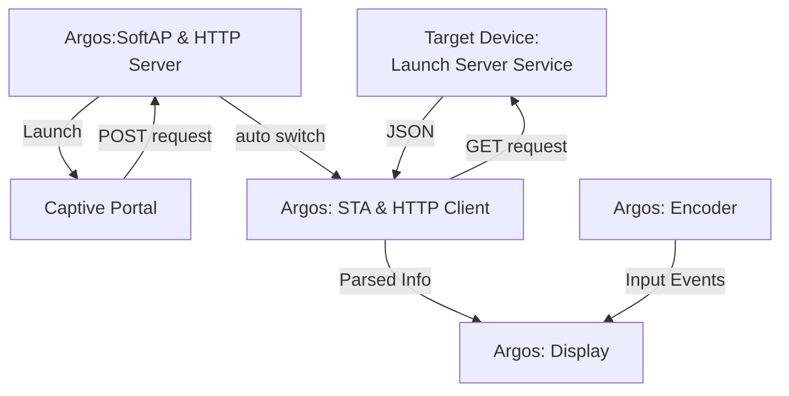

# Argos

[中文](./readme_zh.md) | **English**


## About this project

**Argos** (*Ἄργος*) is a ESP32C3-powered system monitor that displays host system information on a `256*64` OLED screen:
- **Hostname** 
- **CPU Info**: Core Frequency & Temperature / Threads & Cores
- **Memory Info**: Total / Used / Usage Percentage
- **Disk Info**: Total / Used / Usage Percentage
- **OS**: Type / Distro & Version
- **Time**: UTC / Local

---

<div align="center">
  
  
</div>


## How it works

Argos has two components:

1. **A PC-side agent** (`./run_server`) — a binary that collects system metrics (CPU, memory, disk, OS info) and exposes them as a `JSON` HTTP endpoint on port `8080`.

2. **An ESP32 device** — connects to the same Wi-Fi network, polls the agent's `/api/info` endpoint every second, parses the JSON response, and renders the data on the OLED display.



## Deployment

### 1. PC Agent (Server)

A `run_server.py` script is provided under the `/linux` directory to launch the server service on the target device.

```bash
git clone https://github.com/Jav1ki4N/Argos.git
```

```bash
cd linux
./run_server.py
```

If you do not have all the dependencies installed, you can also execute the `run_server` binary file, which has already been compiled and packaged in a Linux environment:

```
./run_server
```

For Windows users, compiling the Python file yourself is required, as a pre-built Windows binary is currently a TODO.

Once running, verify the endpoint is reachable:

```bash
curl http://$(hostname -I | awk '{print $1}'):8080/api/info
```

*Dependencies:

```
Package                   Version
------------------------- -------
Flask                     3.1.3
psutil                    7.2.2
zeroconf                  0.149.7
```

### 2. Captive Portal

The ESP32 is initialized as a SoftAP (Access Point) for your device to connect to. Once connected, a DNS server launches to redirect all DNS queries to a **captive portal** stored in the ESP32's flash memory. You can then fill out a **configuration profile** that contains the following parameters:

- **`SSID`** - The SSID of the target Wi-Fi network.
- **`Password`** - The password for the target Wi-Fi network.
- **`NTP Server`** - The Network Time Protocol (NTP) server.
- **`ProfileName`** - The name of this configuration profile (defaults to **SSID**).


<div align="center">
<p style="font-style: italic;">Captive Portal</p>
</div>
After that, the ESP32 switches to STA mode and locates the target device's IP address and target URL via mDNS. By sending a GET request, the ESP32 receives the system info as a JSON object, which it then parses to populate an information structure.

## PCB

### Prototype

The prototype version of this project and only used for testment. Some issues are:

- Internal on board USB should not be exposed to user in case dual powering path damages the soc and other components.
- External USB should be connected to the on board USB's `D+` and `D-` so that programs can be flashed via external.
- Charing & Charge fininsh LED seems to not behave properly. Also, when powered only by the battery there's no LED to indicate any states.
- The 5V boost circuit of ETA9697 is not used and the `1.7`v voltage drop cause extra heat generation on ME6231.
- Consider replacing the display module with a custom PCB, as it's hard to be universally used and maintain.
- ADC is not precise for getting battery state
- Terrible silkscreen printing..


<div align="center">
<p style="font-style: italic;">Top view</p>
</div>


<div align="center">
<p style="font-style: italic;">Bottom view</p>
</div>

<div align="center">

| Name             | Type               | Value              | Quantity |
| ---------------- | ------------------ | ------------------ | -------- |
| ESP32C3SuperMini | MCU/SOC            | ESP32C3            | 1        |
| Encoder          | Physical Input     | SIQ-02FVS3         | 1        |
| Pin Header       | Connector          | 2*8p               | 1        |
| Power Switch     | Switch             | MSKT-12D14         | 1        |
| USB              | USB                | USB Type-C 16p     | 1        |
| LED              | LED                | 0603               | 2        |
| R1,R2            | Resistor           | 0603 1kohm         | 2        |
| R3,R4            | Resistor           | 0603 100kohm       | 2        |
| R11,R10          | Resistor           | 0603 5.1kohm       | 2        |
| L1               | Inductor           | 2R2 2.2uh          | 1        |
| C1,C2,C3,C4,C5   | Capacitor          | 0603 10uf          | 5        |
| C6,C7            | Capacitor          | 0603 0.1uf         | 2        |
| C8               | Capacitor          | 0603 1uf           | 1        |
| ETA9697          | Battery Charing IC | ETA9697E8A         | 1        |
| ME6231           | LDO                | ME6231C33M5G       | 1        |
| Battery          | Battery            | Li-Po,60x30x48mm   | 1        |
| Display          | Display Module     | SER3.12-D, SSD1322 | 1        |

<p style="font-style: italic;">BOM</p>
</div>


## TODO

- [x] Get system information correctly
- [x] Switch platform to ESP32C3
- [x] Design a PCB and verify it functional
- [x] Write a driver for encoder
- [x] Implant LittleFS as file system
- [x] Redirect to a captive portal on AP mode
- [x] Get configuration profile from captive portal & Connect to target Wi-Fi
- [ ] Support multiple profiles
- [x] Use mDNS to auto-get target device's ip
- [ ] Battey detection via ADC
- [ ] ...

