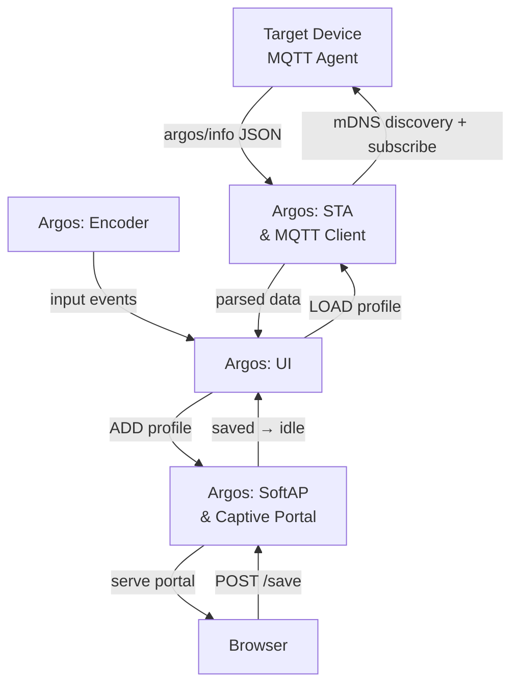

# Argos

[中文](./readme_zh.md) | **English**

 


---

## About

**Argos** (*Ἄργος*) is an ESP32-C3-powered system monitor that displays real‑time host metrics on a `256×64` OLED screen:

> **Project status:** Argos is currently a functional prototype, not a production-ready V1.0 release. The core device/agent telemetry path works, while reproducible firmware builds, automated tests, configuration hardening, and the next PCB revision remain in progress.

| Category     | Metrics                                      |
| ------------ | -------------------------------------------- |
| **Hostname** | System hostname                              |
| **CPU**      | Frequency, temperature, threads, core count  |
| **Memory**   | Total, used, usage %                         |
| **Disk**     | Total, used, usage %                         |
| **OS**       | Type, distro, version                        |
| **Clock**    | SNTP-synchronized local time                 |

### Profiles

Save named configuration profiles to Argos and load them on demand. Each profile stores Wi‑Fi credentials and an NTP server setting. Profiles can be deleted from the device; the current prototype supports up to three slots.

---

<div align="center">
  

  
  <p><em>Argos in action</em></p>
</div>

---

## How It Works

Argos has two components:

1. **Target agent** (`deploy/`) — a Go program that collects system metrics (CPU, memory, disk, OS, temperature), runs an MQTT broker on port `1883`, advertises `_mqtt._tcp` through mDNS, and publishes JSON telemetry to `argos/info` every two seconds.

2. **ESP32 device** — connects to the same Wi‑Fi network, discovers the `argos` MQTT service through mDNS, subscribes to `argos/info`, parses each JSON message, and renders the data on the OLED display.



---

## Components

### Firmware (ESP32)

**[`ESP-DDC`](./components/ESP-DDC)** is the project's custom ESP-IDF abstraction component and is tracked in git. The third-party components below are intentionally gitignored and must exist before a firmware build. Consequently, a clean checkout is not yet self-contained.

| Component | Expected directory | Purpose |
|---|---|---|
| [u8g2](https://github.com/olikraus/u8g2) | `components/u8g2` | OLED graphics (SSD1322 via SPI) |
| [esp_littlefs](https://github.com/joltwallet/esp_littlefs) | `components/esp_littlefs` | LittleFS integration |
| [espressif/mdns](https://components.espressif.com/components/espressif/mdns) | `components/espressif__mdns` | mDNS service discovery |

There is currently no supported one-command dependency bootstrap: the component manifest, local directory layout, and ESP-DDC include paths still need to be normalized. Use versions compatible with ESP-IDF 5.5.4 and verify the include layout before building.

**ESP‑IDF framework** — provided by the SDK:

`driver` · `esp_wifi` · `nvs_flash` · `esp_http_client` · `esp_http_server` · `esp_timer` · `esp_netif` · `mdns` · `mqtt` · `cJSON` · `esp_event` · `freertos` · `lwip`

> The lock file targets **ESP-IDF 5.5.4** on **ESP32-C3**. The component manifest still carries a broader legacy constraint; use 5.5.4 for the current prototype.

### Target Agent

Cross‑platform Go agent; see [Deployment](#1-target-agent) for setup.

| Package | Version |
|---|---|
| [cobra](https://github.com/spf13/cobra) | v1.10.2 |
| [gopsutil](https://github.com/shirou/gopsutil) | v4.26.4 |
| [zeroconf](https://github.com/grandcat/zeroconf) | v1.0.0 |
| [mochi-mqtt](https://github.com/mochi-mqtt/server) | v2.7.9 |

Pre‑built binaries are included for Linux (amd64/arm64) and Windows (amd64) under [`deploy/`](deploy/).

---

## Deployment

### 1. Target Agent

### Binary

Pre‑built binaries are provided under [`deploy/`](deploy/). Pick the one matching your platform:

| Binary                      | Platform                            | Status                                   |
| --------------------------- | ----------------------------------- | ---------------------------------------- |
| `deploy/linux/amd64/argos-linux-amd64` | Linux x86‑64                        | `Verified` with **Ubuntu** 24.04 / 22.04 |
| `deploy/linux/arm64/argos-linux-arm64` | Linux ARM64 (e.g. **Raspberry Pi**) | `Unverified`                             |
| `deploy/windows/argos-windows-amd64.exe` | Windows x86‑64                      | `Unverified`                             |

```bash
# Linux
chmod +x deploy/linux/amd64/argos-linux-amd64
./deploy/linux/amd64/argos-linux-amd64

# Windows
deploy\windows\argos-windows-amd64.exe
```

A better practice is to just to rename the binary as `argos`, which saves a lot of troubles, then:

```bash
sudo mv argos /usr/local/bin/
```

### Build from source:

To build from source you must enter the root directory where `go.mod` is :

```bash
cd deploy
go mod download
```

```bash
# Example platform: linux amd64
GOOS=linux GOARCH=amd64 go build -ldflags="-s -w" -o argos .
```

### Usage

The binary launches argos service in the target machine via cli.

```bash
# check current version
cd linux/amd64
./argos-linux-amd64 --version
                       ___                         
                      /   |  _________ _____  _____
                     / /| | / ___/ __ `/ __ \/ ___/
                    / ___ |/ /  / /_/ / /_/ (__  ) 
                   /_/  |_/_/   \__, /\____/____/  
                               /____/              

===========================================================================
     2026 @ i4N  https://github.com/Jav1ki4N/Argos | Version: Prototype
```

```bash
# Start the MQTT broker and telemetry publisher. Add -v/--verbose to print
# every collected JSON payload.
./argos-linux-amd64 start
2026/06/01 20:38:36 [Argos]: MQTT broker running on 192.168.1.10:1883
2026/06/01 20:38:36 [Argos]: mDNS broadcasting: workstation.local → 192.168.1.10:1883
2026/06/01 20:38:36 [Argos]: Press Ctrl+C to stop
2026/06/01 20:38:36 [Argos]: Publishing to 'argos/info' every 2s
```

```bash
# use -h or --help or help to learn more about the detailed usage
./argos-linux-amd64 --help

argos [-v | --version] [-h | --help | help] <command>

===========================================================================

flags:
	-v, --version Show the current version of Argos
	-h, --help    Show this help message

commands:
	start[-v | --verbose] Start the Argos server to monitor and control your
	ESP32 devices. Use -v or --verbose for detailed logging.

===========================================================================
```

**Verify telemetry** (requires an MQTT client such as Mosquitto):

```bash
mosquitto_sub -h 127.0.0.1 -p 1883 -t argos/info -v
```

### 2. Captive Portal

Selecting **ADD** in the on-device profile menu starts the ESP32 SoftAP. Connect another device to it; the DNS server redirects queries to a **captive portal** hosted from the ESP32 flash. From there, fill in a configuration profile:

| Field          | Description                              |
| -------------- | ---------------------------------------- |
| **SSID**       | Target Wi‑Fi network SSID                |
| **Password**   | Target Wi‑Fi network password            |
| **NTP Server** | Network Time Protocol server             |
| **ProfileName** | Profile name (defaults to SSID)         |

<div align="center">
  
  <p><em>Captive Portal</em></p>
</div>

Saving a profile returns the device to the idle network state. On the OLED, open **NETWORK → PROFILES**, select the saved profile, and choose **LOAD**. The ESP32 then joins the configured Wi-Fi network, discovers the `argos._mqtt._tcp` service through mDNS, and subscribes to `argos/info`.

> Current limitation: the NTP value is stored in the profile, but the firmware currently synchronizes against `pool.ntp.org`. Automatic loading immediately after saving is not implemented yet.

### Prototype limitations

- The firmware dependencies are not fetched automatically by the current manifest, so clean-checkout builds require manual component setup.
- The captive-portal save handler still needs request-size, field, path, and write-result validation.
- The SoftAP password is fixed in firmware and the MQTT broker accepts unauthenticated LAN clients; use only on a trusted development network.
- `argosctl/` is a TUI prototype: its Start/Stop controls currently update UI state only and do not manage the target agent process.
- There are currently no automated firmware or Go tests. Linux amd64 is the only pre-built target documented as hardware-tested.

---

## PCB

>All PCBs are built with ICEDA (EasyEDA)

### Prototype

The prototype revision — built for testing — has several known issues:

- On‑board USB should not be exposed to the user; dual power paths risk damaging the SoC.
- External USB should be wired to the on‑board USB `D+`/`D-` lines so firmware can be flashed externally.
- Charge and charge‑complete LEDs behave incorrectly. No LED indicates state when running on battery alone.
- The ETA9697 5 V boost circuit is unused; the 1.7 V dropout causes excess heat on the ME6231 LDO.
- The display module should be replaced with a custom PCB for better maintainability and fit.
- ADC battery measurement is imprecise.
- Silkscreen quality is poor.

<div align="center">
  
  <p><em>Top view</em></p>
  <br/>
  
  <p><em>Bottom view</em></p>
</div>

### Bill of Materials

<div align="center">

| Name                    | Type                 | Value              | Qty |
| ----------------------- | -------------------- | ------------------ | --- |
| ESP32C3SuperMini        | MCU / SoC            | ESP32-C3           | 1   |
| Encoder                 | Input                | SIQ-02FVS3         | 1   |
| Pin Header              | Connector            | 2×8p               | 1   |
| Power Switch            | Switch               | MSKT-12D14         | 1   |
| USB                     | Connector            | USB Type‑C 16p     | 1   |
| LED                     | LED                  | 0603               | 2   |
| R1, R2                  | Resistor             | 0603 1 kΩ          | 2   |
| R3, R4                  | Resistor             | 0603 100 kΩ        | 2   |
| R10, R11                | Resistor             | 0603 5.1 kΩ        | 2   |
| L1                      | Inductor             | 2.2 µH             | 1   |
| C1–C5                   | Capacitor            | 0603 10 µF         | 5   |
| C6, C7                  | Capacitor            | 0603 0.1 µF        | 2   |
| C8                      | Capacitor            | 0603 1 µF          | 1   |
| ETA9697                 | Battery Charging IC  | ETA9697E8A         | 1   |
| ME6231                  | LDO                  | ME6231C33M5G       | 1   |
| Battery                 | Battery              | Li‑Po 60×30×48 mm | 1   |
| Terminal Block          | Connector            | KF128-2P           | 1   |
| Display                 | Display Module       | SER3.12‑D, SSD1322 | 1   |

<p><em>Bill of Materials</em></p>

</div>

---

## Roadmap

- [x] System information collection
- [x] Platform migration to ESP32‑C3
- [x] PCB design and validation
- [x] Encoder driver
- [x] LittleFS integration
- [x] Captive portal on AP mode
- [x] Configuration profiles via captive portal
- [x] Multi‑profile support
- [x] mDNS auto‑discovery of target device
- [x] Stack‑based UI FSM
- [x] Network task FSM rewrite
- [x] UI rewrite
- [x] Rewrite PC-Side service with Go
- [x] MQTT telemetry transport
- [ ] Battery monitoring via ADC
- [ ] Offline time acquisition
- [ ] Reproducible firmware dependency setup and CI
- [ ] Connect `argosctl` to the real agent lifecycle
- [ ] Harden captive-portal input and profile storage
- [ ] …
