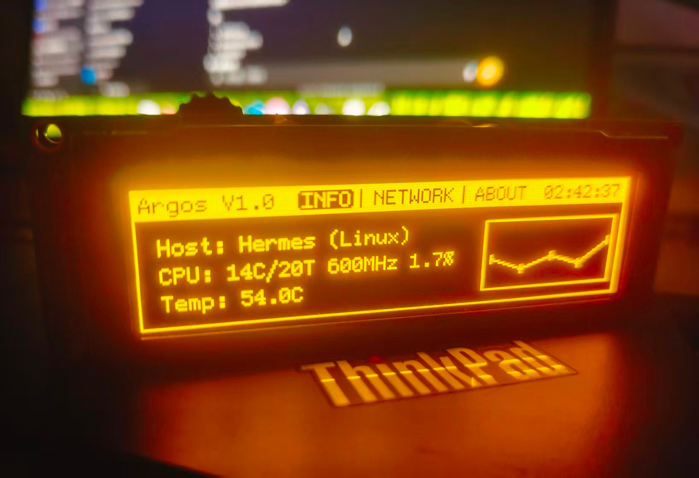
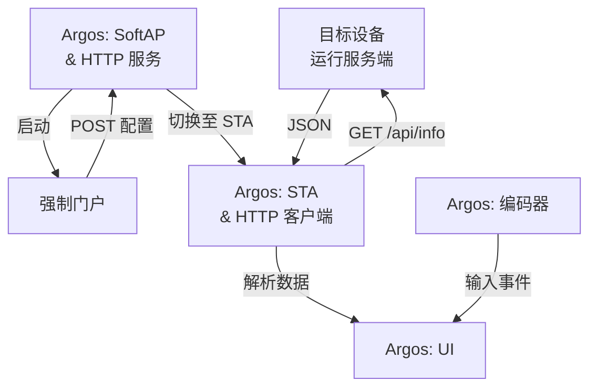

# Argos

[English](./readme.md) | **中文**


---

## 关于

**Argos**（*Ἄργος*）是一台基于 ESP32‑C3 的系统监视器，在 `256×64` OLED 屏幕上实时显示主机指标：

| 分类         | 指标                               |
| ------------ | ---------------------------------- |
| **主机名**   | 系统主机名                         |
| **CPU**      | 频率、温度、线程数、核心数         |
| **内存**     | 总量、已用、使用率                 |
| **磁盘**     | 总量、已用、使用率                 |
| **操作系统** | 类型、发行版、版本                 |
| **时钟**     | UTC 和本地时间                     |

### 配置文件

可通过强制门户将配置文件命名保存到 Argos 并按需加载。每个配置文件存储 Wi‑Fi 凭据、NTP 服务器设置等。你可以随时删除不再需要的配置文件。本项目目前支持最多3个配置槽位。

---

<div align="center">
  
  
  <p><em>从本地加载配置流程演示</em></p>
</div>

---

## 工作原理

Argos 由两部分组成：

1. **目标代理**（`deploy/launch.go`）—— 基于 Go 的系统指标采集程序（CPU、内存、磁盘、操作系统、温度），通过 mDNS 广播并以 JSON HTTP 接口形式暴露在 `8080` 端口。

2. **ESP32 设备** —— 连接到同一 Wi‑Fi 网络，每秒轮询 `/api/info` 接口，解析 JSON 响应并渲染到 OLED 屏幕。



---

## 组件依赖

### 固件 (ESP32)

仅 **[`ESP-DDC`](./components/ESP-DDC)**（项目自有定制组件）纳入 git 版本管理——包含 Argos 全部固件逻辑。其余组件均为第三方库，**被 gitignore 忽略**，构建前推荐自行获取：

| 组件                                                          | 获取方式                                                                 | 用途                       |
| ------------------------------------------------------------- | ------------------------------------------------------------------------ | -------------------------- |
| [u8g2](https://github.com/olikraus/u8g2)                      | `git clone https://github.com/olikraus/u8g2.git components/u8g2`         | 单色图形库，用于UI构建 |
| [esp_littlefs](https://github.com/joltwallet/esp_littlefs)    | `git clone https://github.com/joltwallet/esp_littlefs.git components/esp_littlefs` | 高可靠闪存文件系统          |
| [espressif__mdns](https://github.com/espressif/esp-protocols) | `git clone https://github.com/espressif/esp-protocols.git components/espressif__mdns` | mDNS 服务发现               |

```bash
# 一键下载到本地：
git clone https://github.com/olikraus/u8g2.git components/u8g2
git clone https://github.com/joltwallet/esp_littlefs.git components/esp_littlefs
git clone https://github.com/espressif/esp-protocols.git components/espressif__mdns
```

**ESP‑IDF 框架** —— 由 SDK 提供：

`driver` · `esp_wifi` · `nvs_flash` · `esp_http_client` · `esp_http_server` · `esp_timer` · `esp_netif` · `mdns` · `cJSON` · `esp_event` · `freertos` · `lwip`

> 要求 **ESP‑IDF ≥ 5.0**。

### 目标代理

跨平台 Go 代理；详见[部署](#1-目标代理)。

| 包 | 版本 |
|---|---|
| [gopsutil](https://github.com/shirou/gopsutil) | v4.26.4 |
| [zeroconf](https://github.com/grandcat/zeroconf) | v1.0.0 |

[`deploy/`](deploy/) 目录下提供了 Linux (amd64/arm64) 和 Windows (amd64) 的预编译二进制文件。

---

## 部署

### 1. 目标代理

[`deploy/`](deploy/) 目录下提供了预编译二进制文件，选择对应平台：

| 二进制文件 | 平台 | 状态 |
|---|---|---|
| `deploy/linux/amd64/argos-linux-amd64` | Linux x86‑64 | 已验证（**Ubuntu** 24.04 / 22.04） |
| `deploy/linux/arm64/argos-linux-arm64` | Linux ARM64（如 **树莓派**） | 未验证 |
| `deploy/windows/argos-windows-amd64.exe` | Windows x86‑64 | 未验证 |

```bash
# Linux
chmod +x deploy/linux/amd64/argos-linux-amd64
./deploy/linux/amd64/argos-linux-amd64

# Windows
deploy\windows\argos-windows-amd64.exe
```

更好的做法是将二进制文件重命名为 `argos`，可以省去很多麻烦，然后：

```bash
sudo mv argos /usr/local/bin/
```

### 从源码构建：

进入 `go.mod` 所在根目录：

```bash
cd deploy
go mod download
```

```bash
# 示例平台：linux amd64
GOOS=linux GOARCH=amd64 go build -ldflags="-s -w" -o argos .
```

### 用法

二进制文件通过 CLI 在目标机器上启动 Argos 服务。

```bash
# 查看当前版本
cd linux/amd64
./argos-linux-amd64 --version
                       ___                         
                      /   |  _________ _____  _____
                     / /| | / ___/ __ `/ __ \/ ___/
                    / ___ |/ /  / /_/ / /_/ (__  ) 
                   /_/  |_/_/   \__, /\____/____/  
                               /____/              

===========================================================================
     2026 @ i4N  https://github.com/Jav1ki4N/Argos | Version: Prototype
```

```bash
# 启动服务器，可添加 -v 或 --verbose 以在每次 HTTP 请求时打印详细的 JSON 数据
./argos-linux-amd64 start
2026/06/01 20:38:36 [Argos]: mDNS broadcasting: argos-target.local → 198.18.0.1:8080
2026/06/01 20:38:36 [Argos]: Service is started. You may connect your ESP32 device to this server
2026/06/01 20:38:36 [Argos]: This process could fail if you are using a VPN, it's advised to launch the server before connecting to a VPN
2026/06/01 20:38:36 [Argos]: Press Ctrl+C to stop the server  
```

```bash
# 使用 -h、--help 或 help 了解详细用法
./argos-linux-amd64 --help

argos [-v | --version] [-h | --help | help] <command>

===========================================================================

flags:
	-v, --version Show the current version of Argos
	-h, --help    Show this help message

commands:
	start[-v | --verbose] Start the Argos server to monitor and control your
	ESP32 devices. Use -v or --verbose for detailed logging.

===========================================================================
```

**验证接口：**

```bash
curl http://$(hostname -I | awk '{print $1}'):8080/api/info
```

### 2. 强制门户

ESP32 初始以 SoftAP 模式启动。连接后，DNS 服务器将所有查询重定向到存储在 ESP32 flash 中的**强制门户**。在页面中填写配置信息：

| 字段           | 描述                         |
| -------------- | ---------------------------- |
| **SSID**       | 目标 Wi‑Fi 网络的 SSID       |
| **Password**   | 目标 Wi‑Fi 网络的密码        |
| **NTP Server** | NTP 服务器地址               |
| **ProfileName**| 配置文件名称（默认使用 SSID）|

<div align="center">
  
  <p><em>强制门户</em></p>
</div>

保存后，ESP32 切换至 STA 模式并通过 **mDNS** 定位目标设备。发送 `GET` 请求获取系统信息 JSON，解析后渲染到显示屏。

---

## PCB

### Prototype

Prototype 版本用于功能验证，存在以下已知问题：

- 板载 USB 不应直接暴露，双路供电可能损坏 SoC 及其他元件。
- 外部 USB 应连接至板载 USB 的 `D+`/`D-` 线路，以便通过外部接口烧录固件。
- 充电及充电完成 LED 表现异常。仅电池供电时无 LED 指示状态。
- ETA9697 的 5 V 升压电路未使用，1.7 V 压降导致 ME6231 LDO 产生额外热量。
- 显示模块应替换为定制 PCB，以提高通用性和可维护性。
- ADC 电池测量精度不足。
- 丝印质量较差。

<div align="center">
  
  <p><em>正面视图</em></p>
  <br/>
  
  <p><em>背面视图</em></p>
</div>

### BOM

<div align="center">

| 名称                    | 类型               | 规格               | 数量 |
| ----------------------- | ------------------ | ------------------ | ---- |
| ESP32C3SuperMini        | MCU / SoC          | ESP32‑C3           | 1    |
| Encoder                 | 输入设备           | SIQ-02FVS3         | 1    |
| Pin Header              | 连接器             | 2×8p               | 1    |
| Power Switch            | 开关               | MSKT-12D14         | 1    |
| USB                     | 连接器             | USB Type‑C 16p     | 1    |
| LED                     | LED                | 0603               | 2    |
| R1, R2                  | 电阻               | 0603 1 kΩ          | 2    |
| R3, R4                  | 电阻               | 0603 100 kΩ        | 2    |
| R10, R11                | 电阻               | 0603 5.1 kΩ        | 2    |
| L1                      | 电感               | 2.2 µH             | 1    |
| C1–C5                   | 电容               | 0603 10 µF         | 5    |
| C6, C7                  | 电容               | 0603 0.1 µF        | 2    |
| C8                      | 电容               | 0603 1 µF          | 1    |
| ETA9697                 | 电池充电 IC        | ETA9697E8A         | 1    |
| ME6231                  | LDO                | ME6231C33M5G       | 1    |
| Battery                 | 电池               | 锂聚合物 60×30×48 mm | 1 |
| 接线端子                 | 连接器             | KF128-2P           | 1    |
| Display                 | 显示模组           | SER3.12‑D, SSD1322 | 1    |

<p><em>BOM</em></p>

</div>

---

## Roadmap

- [x] 系统信息采集
- [x] 平台迁移至 ESP32‑C3
- [x] PCB 设计与验证
- [x] 编码器驱动
- [x] LittleFS 文件系统集成
- [x] AP 模式下强制门户
- [x] 通过强制门户配置 Wi‑Fi
- [x] 多配置文件支持
- [x] mDNS 自动发现目标设备
- [x] 基于堆栈的 UI 状态机
- [x] 网络任务状态机重写
- [x] 用 Go 重写 PC 端服务
- [ ] ADC 电池监测
- [ ] UI 重写
- [ ] 离线时间获取
- [ ] …
